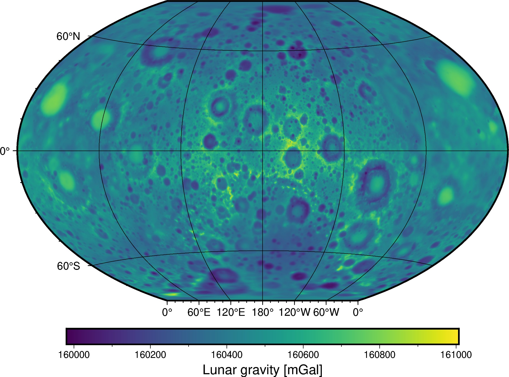

# Moon - Gravity grid at 10 arc-minute resolution

Global 10 arc-minute resolution grids of the amplitude of the gravity
acceleration (gravitational + centrifugal) of the Moon at a constant height.
Generated from the spherical harmonic model GRGM1200B
([Goossens et al., 2019](https://doi.org/10.1029/2019JE006086)).

| | Summary |
|--:|:--|
| File | `moon-gravity-10arcmin.nc` |
| Size | 2.7 Mb |
| Version | [v1](https://github.com/fatiando-data/moon-gravity-10arcmin/releases/latest) |
| DOI | https://doi.org/10.5281/zenodo.10694319 |
| License | [CC-BY](https://creativecommons.org/licenses/by/4.0/) |
| MD5 | `md5:d4b9c45f9cbfb0ff903816f89cd0edcf` |
| SHA256 | `sha256:2b38bdd8ef6ef3af301728387a5a1f27f0a028c0dfc867011125065a3d66acf9` |
| Source | Goossens, S., Sabaka, T. J., Wieczorek, M. A., Neumann, G. A., Mazarico, E., Lemoine, F. G., et al. (2020). High‐Resolution Gravity Field Models from GRAIL Data and Implications for Models of the Density Structure of the Moon's Crust. Journal of Geophysical Research: Planets. doi:[10.1029/2019je006086](https://doi.org/10.1029/2019je006086) ; [NASA's Planetary Geology, Geophysics and Geochemistry Laboratory](https://pgda.gsfc.nasa.gov/products/75) |
| Original license | public domain |
| Processing code | [`prepare.ipynb`](https://nbviewer.org/github/fatiando-data/moon-gravity-10arcmin/blob/main/prepare.ipynb) |

## Changes made

> These are the changes made to the original dataset.

* Expanded the spherical harmonic model into a grid.
* Replaced the GM, radius, and angular velocity of the model the those from
  [Wieczorek (2015)](https://doi.org/10.1016/b978-0-444-53802-4.00169-x).
* Generate the grid at a constant height of 11 km above the reference lunar
  sphere to guarantee the data are outside the topographic masses.

## About this repository

This is a place to format and prepare the original dataset for use in our
tutorials and documentation.

We include the source code that prepares the datasets for redistribution by
filtering, standardizing, converting coordinates, compressing, etc.
The goal is to make loading the data as easy as possible (e.g., a single call
to `pandas.read_csv` or `xarray.load_dataset`).
Whenever possible, the code also downloads the original data (otherwise the
original data are included in this repository).

> 💡 **Tip:** The easiest way to download this dataset is using
> [Pooch](https://www.fatiando.org/pooch), particularly to download straight
> from the DOI of a release.

## Contributing

See our [Contributing Guidelines][contrib] for information on proposing new
datasets and making changes to this repository.

## License

All Python source code is made available under the BSD 3-clause license. You
can freely use and modify the code, without warranty, so long as you provide
attribution to the authors.

Unless otherwise specified, all data files and figures created by the code are
available under the Creative Commons Attribution 4.0 License (CC-BY).

See [`LICENSE.txt`](LICENSE.txt) for the full text of each license.

The license for the original data is specified in this `README.md` file.

[contrib]: https://github.com/fatiando-data/.github/blob/main/CONTRIBUTING.md
